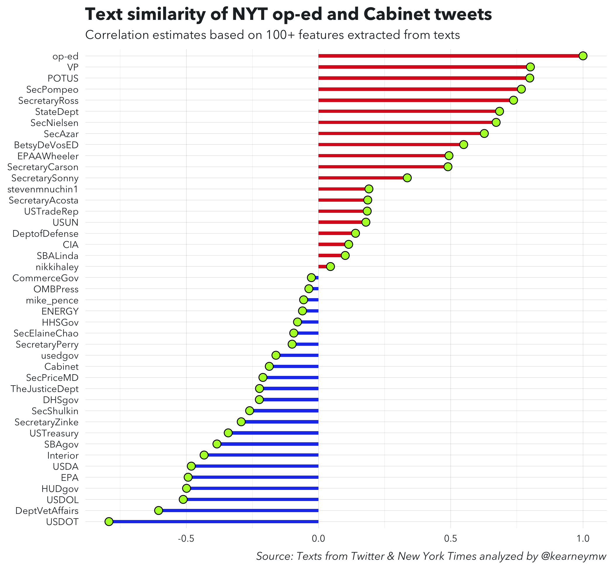

<!-- README.md is generated from README.Rmd. Please edit that file -->

# resist\_oped

🕵🏽 ♀️ Identifying the author behind New York Time’s op-ed from [*inside
the Trump White
House*](https://www.nytimes.com/2018/09/05/opinion/trump-white-house-anonymous-resistance.html).

I compared the paragraphs of the op-ed to tweets posted to timelines by
members of the Cabinet. Here’s what I found:

## Method

I’ve written an [explanation post](resist-oped-text-similarity.md),
which I expect to publish at TBD outlet.

## Code/Estimates

See the [analysis](R/01-features.R) (to replicate, btw, start here as
well) and [visualization](R/02-plot.R) code.

Download the [raw estimates here](estimates.csv) or view the results
below:

| author          |          r |
| :-------------- | ---------: |
| op-ed           |   1.000000 |
| VP              |   0.801063 |
| POTUS           |   0.798661 |
| SecPompeo       |   0.766971 |
| SecretaryRoss   |   0.737344 |
| StateDept       |   0.684387 |
| SecNielsen      |   0.671606 |
| SecAzar         |   0.626870 |
| BetsyDeVosED    |   0.548856 |
| EPAAWheeler     |   0.493172 |
| SecretaryCarson |   0.489422 |
| SecretarySonny  |   0.335650 |
| stevenmnuchin1  |   0.190530 |
| SecretaryAcosta |   0.186096 |
| USTradeRep      |   0.184084 |
| USUN            |   0.179083 |
| DeptofDefense   |   0.139830 |
| CIA             |   0.113995 |
| SBALinda        |   0.100977 |
| nikkihaley      |   0.045223 |
| CommerceGov     | \-0.027009 |
| OMBPress        | \-0.036475 |
| mike\_pence     | \-0.056347 |
| ENERGY          | \-0.060640 |
| HHSGov          | \-0.079406 |
| SecElaineChao   | \-0.093637 |
| SecretaryPerry  | \-0.099864 |
| usedgov         | \-0.161001 |
| Cabinet         | \-0.186110 |
| SecPriceMD      | \-0.210265 |
| TheJusticeDept  | \-0.223151 |
| DHSgov          | \-0.223711 |
| SecShulkin      | \-0.260545 |
| SecretaryZinke  | \-0.292255 |
| USTreasury      | \-0.341385 |
| SBAgov          | \-0.384094 |
| Interior        | \-0.432636 |
| USDA            | \-0.481016 |
| EPA             | \-0.492955 |
| HUDgov          | \-0.498904 |
| USDOL           | \-0.511604 |
| DeptVetAffairs  | \-0.604644 |
| USDOT           | \-0.792344 |

